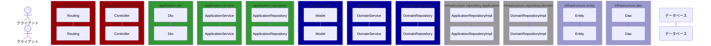

# テンプレート集

## シーケンス図

```mermaid
sequenceDiagram
    actor client as クライアント
    box rgb(153, 0, 0) presentation.routing
        participant Routing
    end
    box rgb(153, 0, 0) presentation.controller
        participant Controller
    end
    box rgb(51, 153, 51) application.dto
        participant Dto
    end
    box rgb(51, 153, 51) application.service
        participant ApplicationService
    end
    box rgb(51, 153, 51) application.repository
        participant ApplicationRepository
    end
    box rgb(0, 0, 153) domain.model
        participant Model
    end
    box rgb(0, 0, 153) domain.service
        participant DomainService
    end
    box rgb(0, 0, 153) domain.repository
        participant DomainRepository
    end
    box rgb(153, 153, 153) infrastructure.repository.application
        participant ApplicationRepositoryImpl
    end
    box rgb(153, 153, 153) infrastructure.repository.domain
        participant DomainRepositoryImpl
    end
    box rgb(153, 153, 204) infrastructure.entity
        participant Entity
    end
    box rgb(153, 153, 204) infrastructure.dao
        participant Dao
    end
    participant database as データベース
```
