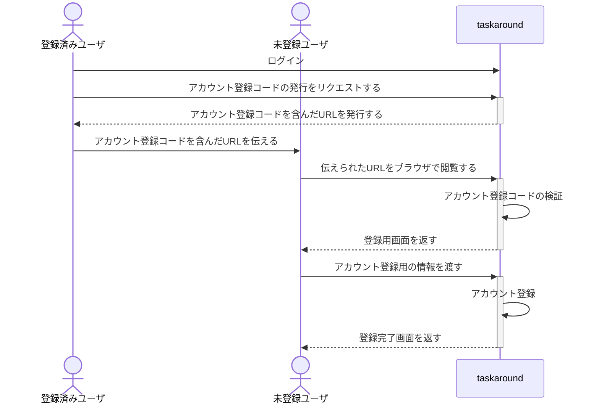
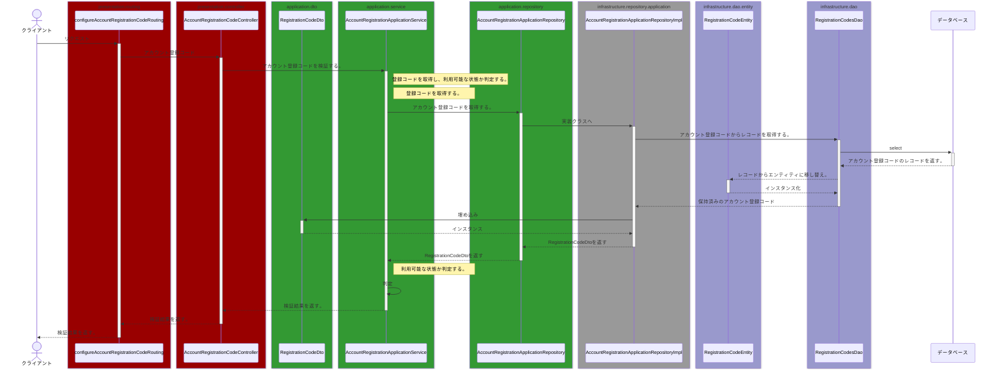
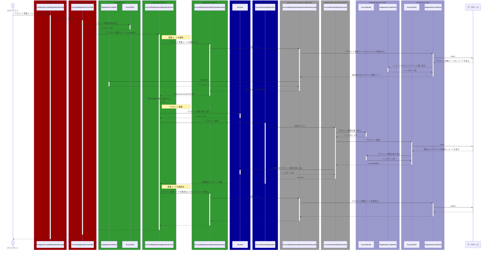

# アカウント登録

## 概要

アカウント登録には登録用のコード（以下、アカウント登録コード）を使用し、サービスへアカウントを追加する。
追加コードは事前にシステム、または他アカウントから発行される。

## フロー

## アカウント登録コードについて

アカウント登録コードは 36 文字（英小文字、数字）の UUID である。
また、アカウント登録コードを利用したアカウント登録には以下の制約がある。

- 一つのアカウント登録コードで一つのアカウントを登録することができる
  - 複数のアカウントを登録できず、使用済みのアカウント登録コードは利用できない
- アカウント登録コードは利用期限があり、発行後 24 時間まで利用することができる。利用期限を過ぎた後にアカウント登録に利用できない。

## システム別詳細設計

### 画面

[wip]

### API

#### アカウント登録コード検証

#### アカウント登録

